# Predicting Drug Sensitivity of Cancer Cell Lines with Multi-Omics Integration into Genomics of Drug Sensitivity in Cancer II (GDSC) data set.
*UC Berkeley AI/ML Professional Certificate — Capstone, Spring 2025*  
Author  |  Brian Rabkin

---

# Executive summary

Precision oncology aims to match drugs to tumor profiles in-silico, cutting costly wet-lab screens. The **Genomics of Drug Sensitivity in Cancer II (GDSC 8.5)** dose–response data (278 drugs × 900 cell lines) was combined with three omics layers — DNA methylation, somatic mutation and gene expression (PCA → 100 PCs) — to build a suite of models predicting ln-IC50. Model perforamnce was evaluated at the global level utilizing all the data and ta the group level by grouping the data into drug target-pathway by cancer type. The root-mean-sauared error (RMSE), mean-avearage-error (MAE) and R2 were utilized for model evaluations.

1. **Baseline (GDSC only):**  
   - **LightGBM** achieved **RMSE = 1.54**, **R² = 0.68**, and covered **271/622** drug-pathway–cancer groups above R² ≥ 0.5.  
2. **Multi-omics integration (GDSC + M + E):**  
   - Adding methylation + expression cut RMSE to **1.52** (−1.3 %), lifted R² to **0.69** (+1.5 %), and increased coverage to **279/622**.  
3. **Feature selection & hyper-tuning:**  
   - A final LightGBM with 411 selected features and Optuna-tuned hyperparameters delivered **RMSE = 1.45**, **R² = 0.72**, and **34/622** groups above R² ≥ 0.9.

SHAP analysis highlights **expr_PC1**, **expr_PC3**, and **Mitosis pathway** as the strongest drivers of drug sensitivity vs. resistance.  


# Rationale

* Cancer remains on of the leading causes of death globally, costly to treat, and personalized medicine is key to effective treatment.
* Development of therapies is a costly venture. Therefore, reducing development time and resources will help advance new drug candidates through the pipeline.
* Wet-lab dose–response assays cost \$10–\$40 per compound–cell-line pair.  
* A predictive **in-silico triage** system focuses experiments on the most promising drug–tumour pairs, accelerating biomarker discovery and reducing R&D cost.  
* Next-generation sequencing data are now routine; integrating these omics layers into predictive models enables **personalised therapy selection**.

## Objectives 
- Leverage publicly available Genomics of Drug Sensitivity in Cancer (GDSC-II v8.5) datasets for training and evaluation of the model.  
  
- Integrate methylation, mutation and expression  datasets, from other publically available sources, with the GDSC II dataset.

- Develop and evaluate machine learning models for predicting the drug log-IC50 for specific cancers, cell types and drugs. 

- Evaluate whether methylation, mutation and/or expression are key features for predicting drug IC50.  

---

# Research Question
**Can multi-omics features (DNA methylation, somatic mutations, gene expression) improve the prediction of ln-IC50 for drugs tested in Genomics of Drug Sensitivity in Cancer (GDSC) datasets when applied to *new, previously unseen* cancer cell lines?**

# Data Sources
The following datasets were downloaded and combined into a single dataframe ***(merged_df)*** using COSMIC_ID and Drug_id as keys into a single input for data understanding and preperation. 

 | Layer | File | Rows × Cols (after QC) | Release|
 | 	-------	 | 	------	 | 	-------------	 | 	--------	 | 
 | 	**Drug response (core)**	 | 	[GDSC2_fitted_dose_response_27Oct23.xlsx](https://cog.sanger.ac.uk/cancerrxgene/GDSC_release8.5/GDSC2_fitted_dose_response_27Oct23.xlsx) | 	295 drugs × 242 k assays	 | 	GDSC 8.5	 | 
 | 	**Drug compound annotations**	 | 	[screened_compounds_rel_8.5.csv](https://cog.sanger.ac.uk/cancerrxgene/GDSC_release8.5/screened_compounds_rel_8.5.csv)	 | 	621	 | 	GDSC 8.5	 | 
 | 	**Cell metadata**	 | 	[Cell_Lines_Details.xlsx](https://cog.sanger.ac.uk/cancerrxgene/GDSC_release8.5/Cell_Lines_Details.xlsx)	 | 	1001	 | 	GDSC 8.5	 | 
 | 	DNA-methylation	 | 	[GSE68379_Matrix.processed.txt.gz](https://ftp.ncbi.nlm.nih.gov/geo/series/GSE68nnn/GSE68379/suppl/GSE68379_Matrix.processed.txt.gz)	 | 	486 k probes	 | 	GEO GSE68379	 | 
 | 	WES mutations	 | 	[WES_variants.xlsx](ftp.sanger.ac.uk//pub/project/cancerrxgene/releases/release-7.0/WES_variants.xlsx) | 	486 k genes	 | 	GDSC 7.0	 | 
 | 	Gene expression	 | 	[sanger1018_brainarray_ensemblgene_rma.txt.gz](ftp.sanger.ac.uk/pub/project/cancerrxgene/releases/release-7.0/sanger1018_brainarray_ensemblgene_rma.txt.gz)	 | 	18 k genes	 | 	GDSC 7.0	 | 

---

# Methodology

1. **Data engineering**  
   *Key steps*  
    * Parse omics files, harmonise **COSMIC_ID** and **DRUG_ID** keys  
    * Filter mutation table to 478 curated driver genes; create binary flags  
    * Derive methylation **median** & **std** per cell line (→ 2 features)  
    * PCA-reduce expression to top-100 PCs (80 % variance)  
    * Merge into a single `merged_df` (224 104 rows × 1 219 features)  
    * Split 80 / 20 by **COSMIC_ID** (GroupShuffle) to keep unseen cell lines for the validation dataset
    * Create confidence weights `w = 1 / (dose rmse + ε)` (top 1 % clipped)

    EDA notebooks ([00_download.ipynb](notebooks/00_download.ipynb), [01_eda.ipynb](notebooks/01_eda.ipynb)) show missingness maps,
    lineage distributions and pair-plots of ln-IC50 vs omics summaries.


2. **Data Splitting - Drug-Wise Stratified Unseen Cell Line Split**
  
    To evaluate the ability of models to predict the ln_ic50 of unseen cell lines, the data was split to ensure the test set has unseen cell lines for each drug.

    There are a total of **622 drug pathway-cancer combinations** when statifying the data by drug target-pathway and cancer (feautures: pathway, cancer_type).


3. **Baseline Model** 

    For the baseline model, an LGBMRegressor was trainined on the core (GDSC) data set only and without weights. For the purpose of comparing regressor with classification models, regression predictions are additionally thresholded at each drug’s 25% IC50 quantile to compute AUROC / PR-AUC, enabling direct comparison with binary classifiers. This enambled the calculation of Accuaryc, Precision, Recall, RMSE, MAE and FBeta. 

---
4. **Model Families Evaluated**

    In this sudy, a series of regression (4), classificaiton (1) and deep learning (1) models will be evaluate using the complete combined dataset of GDSC drug response, methylation, mutation and expression.  Models will be evaluated and the best model selected for determining if the addition of some or all of the non-GDSC data improved model performance.

    The initial list of models includes:

    | 	Model	 | 	Brief description / notes	 | 	Library	 | 
    | 	--------	 | 	-----------	 | 	----------	 | 
    | 	***Continuous-target (regression)***	 | 		 | 		 | 
    | 	LGBMRegressor (baseline & optimized)	 | 	Gradient-boosted decision trees, native categorical support, fast on 100 k + rows	 | 	lightgbm	 | 
    | 	XGBRegressor	 | 	Complementary GBDT implementation; often rivals/edges out LightGBM on tabular data	 | 	xgboost	 | 
    | 	MLPRegressor	 | 	Feed-forward neural net (dense) – serves as the neural-network baseline	 | 	scikit-learn / PyTorch-TabNet	 | 
    |   ElasticNet     |  Regularized linear regression model that combines the penalties of both Lasso (L1) and Ridge (L2) regression| scikit-learn |
    | 	***Binary-target (classification)***	 | 		 | 		 | 
    | 	DecisionTreeClassifier	 | 	Transparent baseline; matches your current pipeline	 | 	scikit-learn	 | 
  


5. **Feature Addition Experiment**

    The following combination of data sets were used to train the best model family to evaluate the contribution of methylation, mutation and expression to with the GDSC on model performance.

    | 	Condition	 | 	GDSC	 | 	Methylation (M)	 | 	Mutation (V)	 | 	Expression (E)	 | 
    | 	--------	 | 	-----------	 | 	--------	 | 	-----------	 | 	----------	 | 
    | 	Impact of GDSC only *	 | **✔** | 		 | 		 | 		 | 
    | 	Impact of GDSC with M	 | ✔ | ✔ | 		 | 		 | 
    | 	Impact of GDSC with M + V	 | ✔ | ✔ |  ✔ | 		 | 
    | 	Impact of GDSC with  M + E	 | ✔ | ✔ | 		 |  ✔ | 
    | 	Impact of GDSC with  M + V + E	 | ✔ |  ✔ |  ✔  |  ✔ | 
      * Used for Base Models and Selection of the Best Model				

6. **Final Model: Feature-selection & Hyper-tune (best feature combo)** 
 Feature selection was performed on 20% of the GDSC + Methylation and Expression dataset using `SelectFromModel` wrapped around LightGBM's LGBMRegressor. While, erformance of the feature selection was done with 100% of the data.

 The selected features were then used to hypertune the LBMRegressor model using RandomSearchCV and a three fold cross validation using GroupKFold.

7. **Interpretation** 
SHAP TreeExplainer  was utilized to interprete the features importance of the hypertuned LGBMRegressor.

## Evaluation Metrics

The regression models were evaluated based on two criterias. The first, models were ranked based on the mean of the order of the RMSE (ascending), MAE (ascending) and R2 (decending). And, second, the number of drug target pathway-cancer combinations above an R2 cuttoff of 0.5 for model family selection and 0.9 for feature addition and feature selection.

For the purpose of comparing regressor with classification models, regression predictions are additionally thresholded at each drug’s 25% IC50 quantile to compute Precision, Accuracy and FBeta, enabling direct comparison with binary classifiers. 

# Results

## Data set
The merged data set has 921 cell lines with drug response data for 278 drugs.  Due to the high dimensionality, a subset of drugs is shown below for purposes of illustrating the data.  Since the models focus exclusively on predicting ln IC50, the other dose–response summary metrics (z-score, AUC, and RMSE) were removed and retained only the IC50 as the target variable.

 | 	Condition	 | 	Number	 | 	Number	 | 
 | 	--------	 | 	-----------	 | 	-----------	 | 
 | 	Drugs	 | 		 | 	286	 | 
 | 		 | 	Target Pathways	 | 	24	 | 
 | 		 | 	Targets	 | 	185	 | 
 | 	Cell Lines	 | 		 | 	912	 | 
 | 		 | 	Tissue Types (desc 1)	 | 	19	 | 
 | 		 | 	Tissue Types (desc 1)	 | 	55	 | 
 | 		 | 	Cancer Types	 | 	32	 | 
 | 		 | 	Growth Properties	 | 	3	 | 
 | 	Methylation sites	 | 		 | 	485.5 K*	 | 
 |     | 		* Median and Std / cell line used  as features| 	| 
 | 	Mutation Sites	 | 	 	 |   | 
 |  	 | 	mutations (any non-synonymous variant present)	 | 	478	 | 
 | 		 | 	misssense	 | 	13	 | 
 | 		 | 	indels	 | 	133	 | 
 | 		 | 	truncation	 | 	0	 | 
 | 		 | 	other (not missense, indels, truncations)	 | 	478	 | 
 | 	Expression	 | 	  	 | 	  	 | 
 | 	 	 | 	Genes (used to generate PCA)	 | 	486 k	 | 
 | 		 | 	Principle Components	 | 	100	 | 

**Filter dataset**

The dataset was filtered to remove drug-cancer combinations with less than 10 samples

| Total number of rows in raw dataset:                      | 224,104 | 
| --------- | ------| 
| Rows kept after filtering for >=10 samples / drug-cancer: | 215,263  (96.1 %) | 
| Number of cancer types:  | 26   |
| Number of drugs:         | 286  |
| Number of cell lines:    | 889. |
| Total number of unique drug pathway and cancer_type combinations: | 622 |

## Visulaizaiton of data

**Cell Information:**

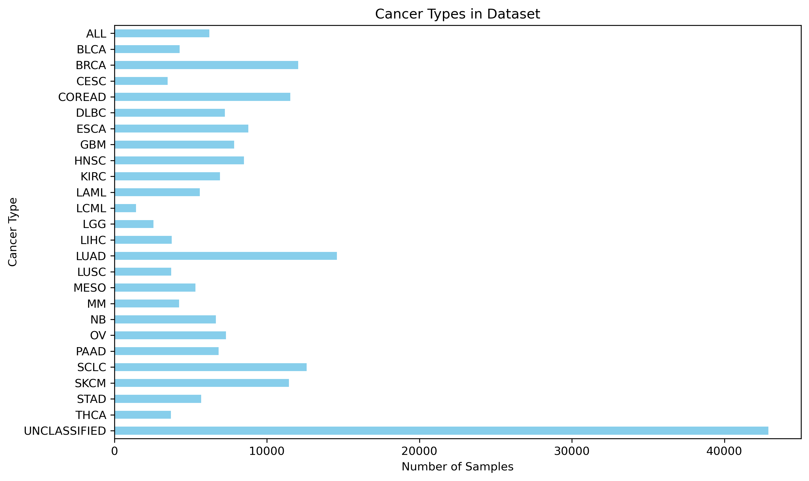<br>
Figure: Number of cell lines per cancer type


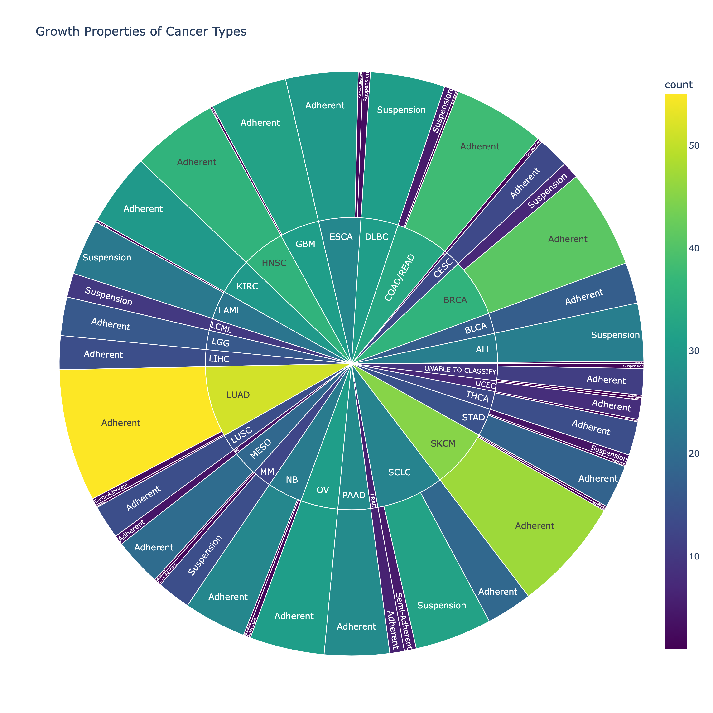<br>
Figure: Growth properites of cell lines by cancer type.

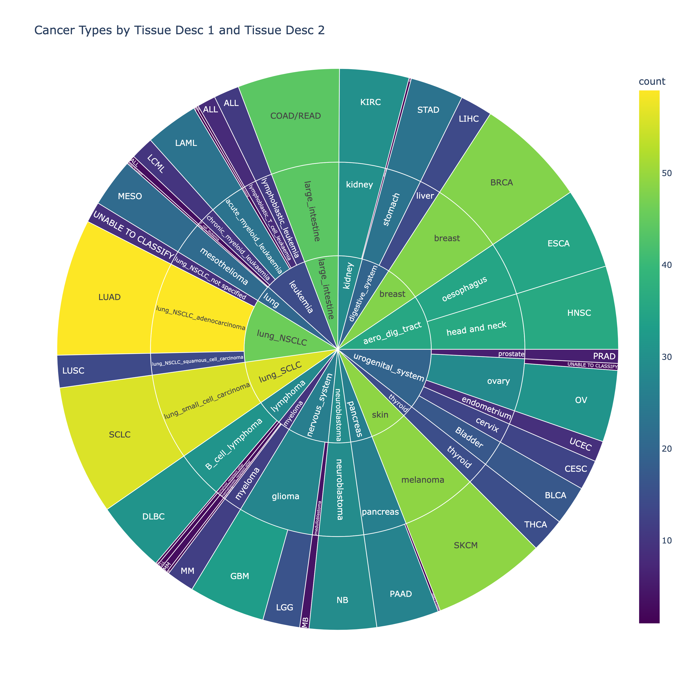<br>
Figure: Tissue types 1 and 2 of cell lines by cancer type


**Drug Information:**

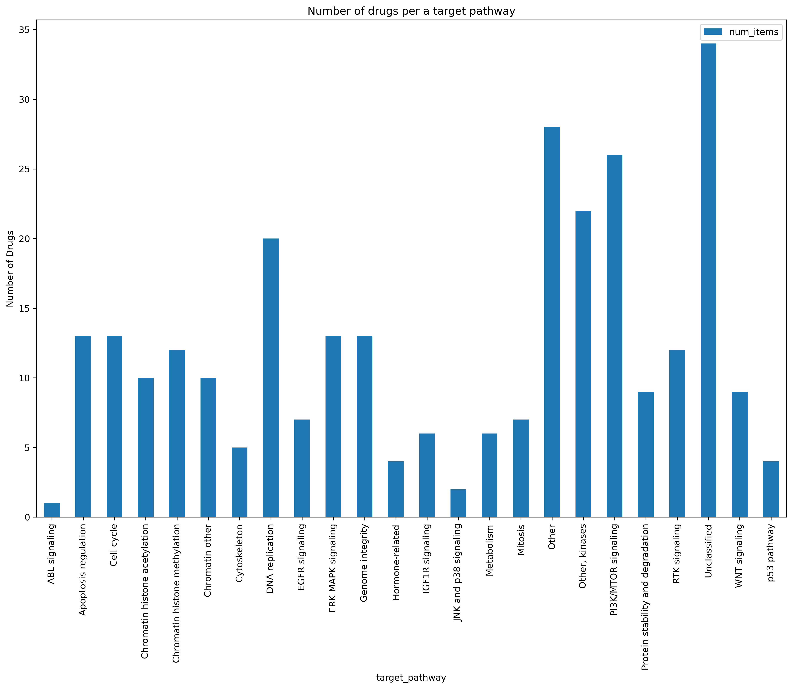<br>

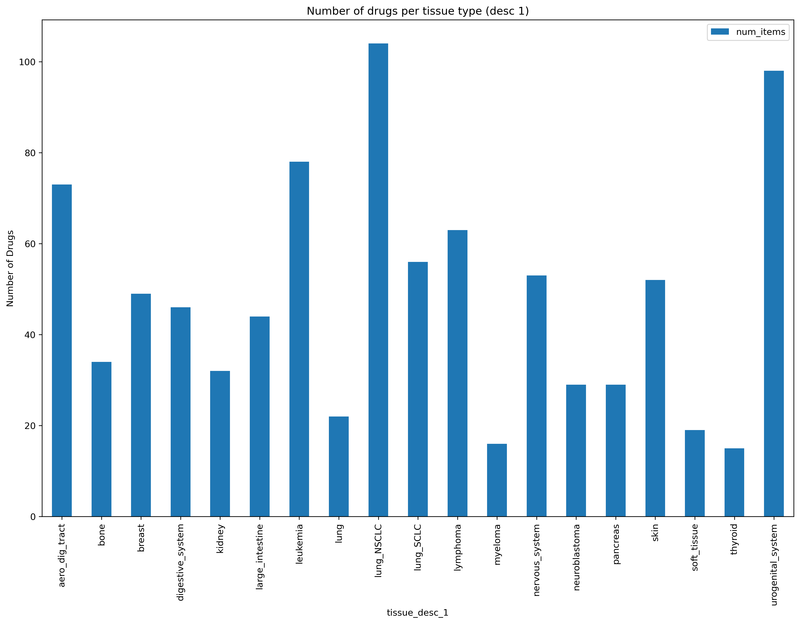<br>

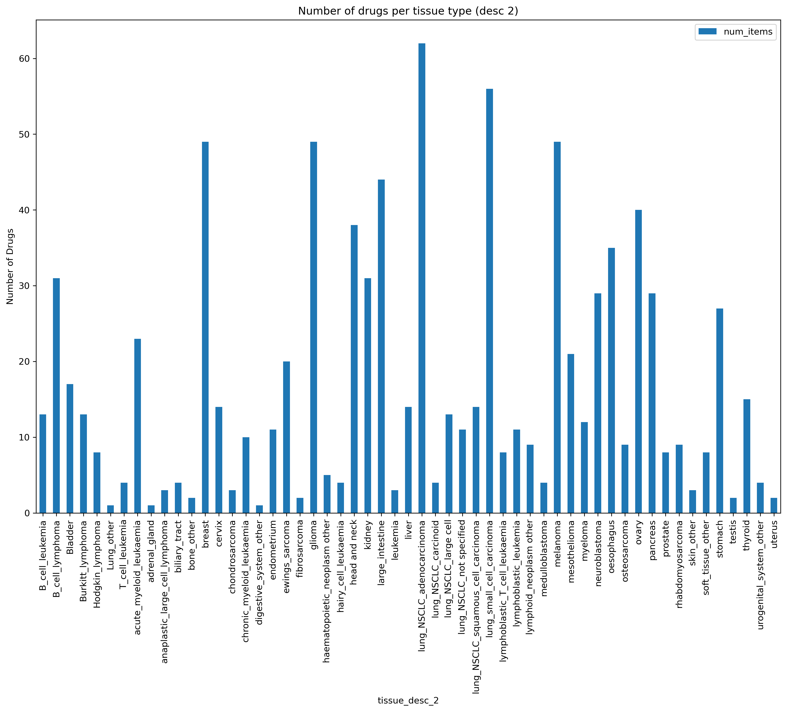<br>


A subset of drugs is plotted to reduce the clutter in the plot:
  ['Cisplatin', 'Docetaxel', 'Doxorubicin', 'Epirubicin',  'Erlotinib','Gefitinib', 
   'Gemcitabine', 'Navitoclax','Paclitaxel', 'Sorafenib', 'Temozolomide']


<br>
Figure of target and pathway for subset of drugs

**Data Split Distributions**

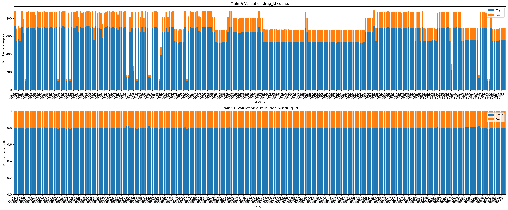<br>
Data train & validation split (80:20) by drug id (left: counts, right: normalized).

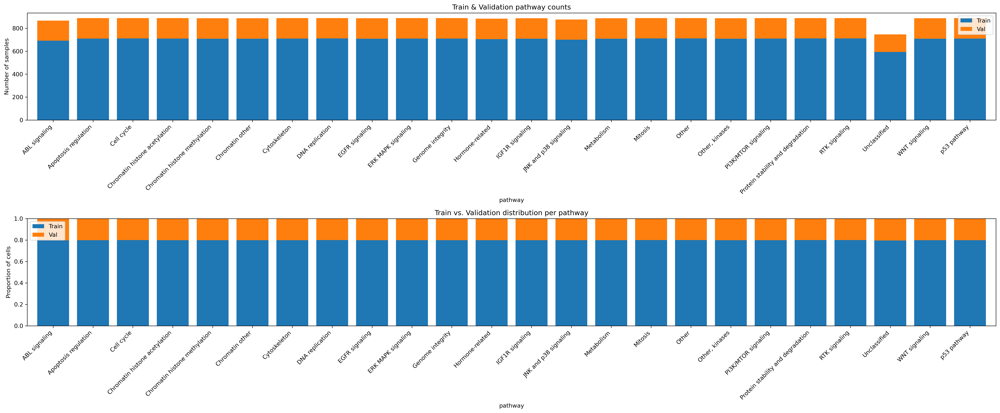<br>
Data train & validation split (80:20) by drug target pathway (left: counts, right: normalized).

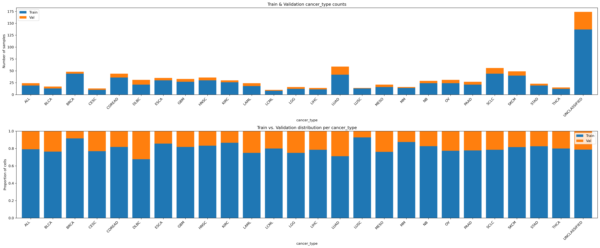<br>
Data train & validation split (80:20) by cancer type (left: counts, right: normalized).


## Model evaluation

### Baseline Model Performance:

The baseline LGBMRegressor model achieved a 0.684 R^2 and Accuarcy of 0.73 across the whole filtered dataset.

Model Information:
| Model Info                           | Split   | Model_Type   |   Time |   Accuracy |   Precision |   Recall |   FBeta |   PR_AUC |   RMSE |   MAE |    R2 |   
|:-------------------------------------|:--------|:-------------|-------:|-----------:|------------:|---------:|--------:|---------:|-------:|------:|------:|
| LGBMRegressor: GDSC (baseline model) | Train   | regression   |  0.974 |      0.735 |        0.46 |    0.34  |   0.391 |      nan |  1.528 | 1.163 | 0.684 |
| LGBMRegressor: GDSC (baseline model) | Test    | regression   |  0.071 |      0.729 |        0.46 |    0.355 |   0.401 |      nan |  1.538 | 1.171 | 0.683 | 


Number of drug pathway-cancer combos with R2 above the Cuttoff of 0.5 was 271 out of 622.

Results for pathway-cancer combos above cuttoff of 0.5
| Model                        |   Num above cuttoff |   Max |   Mean |
|:-----------------------------|--------------------:|------:|-------:|
| LGBMRegressor: lgb_base_pipe |                 271 |  0.95 |   0.73 |

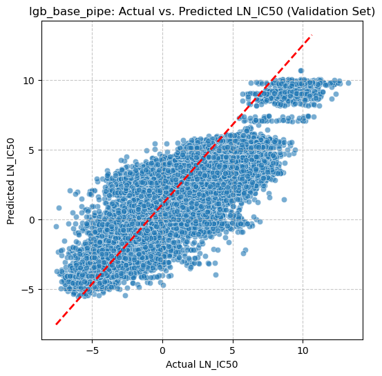<br>
Figure: Scatter plot of prediction and target


<br>
Figure: Box plot of the mean R2 by key feature in the GDSC dataset. Note 
that the mean and distribution of R2 of models improves when binned by cell traits as compared to drug traits. These figures are available for all models in the 02_modeling notebook.


<br>
Figure: Number of pathway-cancer combinations with R2 above the cuttoff.

### Model Family Selection Results:

For all the models trained on the core GDSC data set (C), MLPRegressor had the highest performance based on rank (lower score better, see figure below) and number of drug pathway-cancer combinations above an R2 value of 0.5 (see table).

- MLPRegressor also outperformed the DecisionTree model based on all metrics (precision, accuracy and FBeta) except recall.  

- The MLPRegressor took over 13 times longer to train than the LGBMRegressor, which was ranked second and had slightly fewer pathway-cancer combinations at each cuttoff. 

- The addition of training weights resulted in a slightly poorer performing model when comparing LGBMRegressor with and without the weights. Therefore, weights will not be utilized in the remainder of the study.

Therefore, the LGMRegressor type will be utilized for the Feature Addition and the Feature Selection experiments.

Table: Model Training Metrics:

|	Model	|	DataSet	|	Features	|	Split	|	Model_Type	|	Time	|	Accuracy	|	Precision	|	Recall	|	FBeta	|	RMSE	|	MAE	|	R2	|
|	--------	|	--------	|	--------	|	--------	|	--------	|	--------	|	--------	|	--------	|	--------	|	--------	|	--------	|	--------	|	--------	|
|	LGBMRegressor: GDSC baseline	|	GDSC	|	309	|	Train	|	regression	|	0.94	|	0.74	|	0.46	|	0.34	|	0.39	|	1.53	|	1.16	|	0.68	|
|	LGBMRegressor: GDSC baseline w/ training weights	|	GDSC	|	309	|	Train	|	regression	|	0.93	|	0.75	|	0.49	|	0.25	|	0.33	|	1.57	|	1.19	|	0.67	|
|	DecisionTreeClassifier: GDSC	|	GDSC	|	309	|	Train	|	classification	|	1.28	|	0.32	|	0.24	|	0.79	|	0.37	|	0.42	|	0.18	|	0.06	|
|	XGBRegressor: GDSC	|	GDSC	|	309	|	Train	|	regression	|	0.38	|	0.32	|	0.24	|	0.79	|	0.37	|	3.92	|	3.42	|	-1.08	|
|	MLPRegressor: GDSC	|	GDSC	|	309	|	Train	|	regression	|	12.32	|	0.76	|	0.52	|	0.43	|	0.47	|	1.45	|	1.09	|	0.72	|
|	ElasticNet: GDSC	|	GDSC	|	309	|	Train	|	regression	|	0.20	|	0.55	|	0.25	|	0.40	|	0.31	|	2.72	|	2.07	|	0.00	|

Table: Model Validation Metrics:

|	Model	|	DataSet	|	Features	|	Split	|	Model_Type	|	Time	|	Accuracy	|	Precision	|	Recall	|	FBeta	|	RMSE	|	MAE	|	R2	|
|	--------	|	--------	|	--------	|	--------	|	--------	|	--------	|	--------	|	--------	|	--------	|	--------	|	--------	|	--------	|	--------	|
|	LGBMRegressor: GDSC baseline	|	GDSC	|	309	|	Test	|	regression	|	0.07	|	0.73	|	0.46	|	0.36	|	0.40	|	1.54	|	1.17	|	0.68	|
|	LGBMRegressor: GDSC w/ training weights	|	GDSC	|	309	|	Test	|	regression	|	0.07	|	0.74	|	0.49	|	0.26	|	0.34	|	1.59	|	1.20	|	0.66	|
|	DecisionTreeClassifier: GDSC	|	GDSC	|	309	|	Test	|	classification	|	0.03	|	0.33	|	0.25	|	0.79	|	0.38	|	0.47	|	0.22	|	-0.15	|
|	XGBRegressor: GDSC	|	GDSC	|	309	|	Test	|	regression	|	0.03	|	0.33	|	0.25	|	0.79	|	0.38	|	3.87	|	3.37	|	-1.01	|
|	MLPRegressor: GDSC	|	GDSC	|	309	|	Test	|	regression	|	0.03	|	0.74	|	0.49	|	0.43	|	0.46	|	1.52	|	1.15	|	0.69	|
|	ElasticNet Regression: GDSC	|	GDSC	|	309	|	Test	|	regression	|	0.03	|	0.55	|	0.25	|	0.40	|	0.31	|	2.73	|	2.07	|	0.00	|

\* regression outputs thresholded at within-drug 25 % IC50 quantile.

Key metrics for evaluating modles with the validation dataset:
| Model Info                              |   avg_rank |   RMSE |     R2 |   MAE |
|:----------------------------------------|-----------:|-------:|-------:|------:|
| MLPRegressor: GDSC                      |          1 |  1.518 |  0.691 | 1.146 |
| LGBMRegressor: GDSC (baseline model)    |          2 |  1.538 |  0.683 | 1.171 |
| LGBMRegressor: GDSC w/ training weights |          3 |  1.591 |  0.66  | 1.199 |
| ElasticNet Regression: GDSC             |          4 |  2.731 | -0.001 | 2.067 |
| XGBRegressor: GDSC                      |          5 |  3.867 | -1.006 | 3.368 |

<BR>
<br>
Figure: Models ranked by score of the mean rank of RMSE (assending), R2 (descending) and MAE (assending). Higher overall performance is based on the lowest rank score.

Results for pathway-cancer combos above cuttoff of 0.5
| Model                                |   Num above cuttoff |    Max |   Mean |
|:-------------------------------------|--------------------:|-------:|-------:|
| mlp_base_pipe                        |                 289 |   0.96 |   0.73 |
| LGBMRegressor: lgb_base_pipe         |                 271 |   0.95 |   0.73 |
| LGBMRegressor: lgb_core_weights_pipe |                 249 |   0.96 |   0.72 |
| DecisionTreeClassifier: GDSC         |                   0 | nan    | nan    |
| ElasticNet Regression: GDSC          |                   0 | nan    | nan    |
| XGBRegressor: GDSC                   |                   0 | nan    | nan    |

<BR>
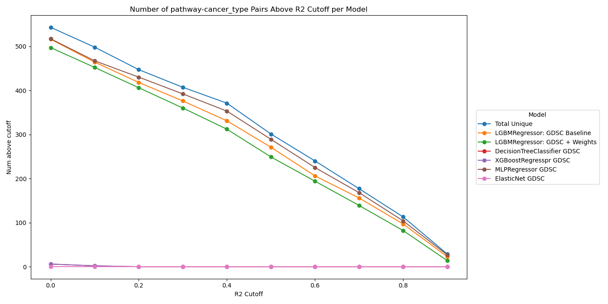<br>
Figure: Number of pathway-cancer combinations with R2 above the cuttoff.


### Feature Addition Experiment Results:
Feature Addition Experiment
Model performance was evaluated for the LGBMRegressor type model with addition of Methylation, Mutation (Variant) and Expression Datasets to the GDSC dataset.


    The following combination of data sets was used to evaluate the contribution of methylation, mutation and expression to with the GDSC on model performance for the leading model type (LGBMRegressor).

 | 	Condition	 | 	Abbreviation	 | 	GDSC	 | 	Methylation (M)	 | 	Mutation (V)	 | 	Expression (E)	 | 
 | 	--------	 | 	----------	 | 	-----------	 | 	--------	 | 	-----------	 | 	----------	 | 
 | 	Impact of GDSC only *	 | 	C	 | 	Y	 | 		 | 		 | 		 | 
 | 	Impact of GDSC with M	 | 	CM	 | 	Y	 | 	Y	 | 		 | 		 | 
 | 	Impact of GDSC with  M + E	 | 	CME	 | 	Y	 | 	Y	 | 		 | 	Y	 | 
 | 	Impact of GDSC with M + V	 | 	CMV	 | 	Y	 | 	Y	 | 	Y	 | 		 | 
 | 	Impact of GDSC with  M + V + E	 | 	CMVE	 | 	Y	 | 	Y	 | 	Y	 | 	Y	 | 
	* Used for Base Models and Selection of the Best Model Type											

Results:

- Expression PCs (the “E” block) are by far the most valuable addition, driving both lower RMSE and higher coverage of well-predicted groups.

- Methylation (M) or mutation (V) on their own slightly degrade performance, but when combined with expression they yield marginal gains (CMVE vs CME).

- Trade-off: CME (GDSC + M + E) hits ~95 % of the full-block benefit (R² = 0.689 vs 0.692) with ~400 features instead of ~1 500 → faster training and simpler interpretation.

Therefore, feature selection will be performed on the GDCS dataset and on the GDSC + methylation and Expression.
<br>
<br>
																																													
Rank of Model Addition Performance for Validation:	
| Model Info                                 |   avg_rank |   RMSE |    R2 |   MAE |
|:-------------------------------------------|-----------:|-------:|------:|------:|
| LGBMRegressor: GDSC + MVE feature addition |       1    |  1.516 | 0.692 | 1.152 |
| LGBMRegressor: GDSC + ME feature addition  |       2    |  1.524 | 0.689 | 1.159 |
| LGBMRegressor: GDSC feature addition       |       3    |  1.538 | 0.683 | 1.171 |
| LGBMRegressor: GDSC + MV feature addition  |       4.33 |  1.555 | 0.676 | 1.188 |
| LGBMRegressor: GDSC + M feature addition   |       4.67 |  1.556 | 0.675 | 1.187 |


Total number of unique drug pathway and cancer_type combinations: 622
Number of target-pathway × cancer type groups with R2 above the Cuttoff
| Model                                  |   0.0 |   0.1 |   0.2 |   0.3 |   0.4 |   0.5 |   0.6 |   0.7 |   0.8 |   0.9 |
|:---------------------------------------|------:|------:|------:|------:|------:|------:|------:|------:|------:|------:|
| Total Unique                           |   555 |   512 |   457 |   416 |   359 |   296 |   231 |   171 |   110 |    28 |
| LGBMR_GDSC_pipe_feature_addition       |   516 |   464 |   418 |   376 |   331 |   271 |   206 |   156 |    97 |    23 |
| LGBMR_GDSC + M_pipe_feature_addition   |   503 |   453 |   406 |   370 |   316 |   260 |   203 |   145 |    91 |    22 |
| LGBMR_GDSC + ME_pipe_feature_addition  |   532 |   479 |   434 |   387 |   331 |   279 |   216 |   158 |   105 |    20 |
| LGBMR_GDSC + MV_pipe_feature_addition  |   510 |   449 |   408 |   370 |   316 |   263 |   202 |   144 |    93 |    22 |
| LGBMR_GDSC + MVE_pipe_feature_addition |   537 |   491 |   438 |   395 |   333 |   277 |   220 |   158 |   101 |    24 |


<BR>
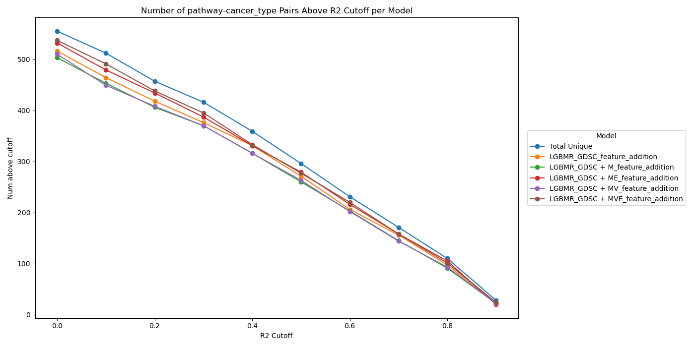<br>
Figure: Number of target-pathway × cancer type groups with R2 above the cuttoff.


### Feature Selection Results:

To reduce the time to perform permutation importance, 20% of the drugs are randomly selected for permutation.

The final model will be trained on the full drug set using the importance features from the permutation.

The feature selection LGBMRegressor model using GDSC + ME outperforms all other models based on average rank score.

**Rank of LGBMRegressor models after feature selection**

| Model Info                                 |   avg_rank |   RMSE |    R2 |   MAE |
|:-------------------------------------------|-----------:|-------:|------:|------:|
| LGBMRegressor: GDSC + ME feature selection |       1    |  1.513 | 0.693 | 1.149 |
| LGBMRegressor: GDSC + MVE feature addition |       2    |  1.516 | 0.692 | 1.152 |
| LGBMRegressor: GDSC + ME feature addition  |       3    |  1.524 | 0.689 | 1.159 |
| LGBMRegressor: GDSC feature addition       |       4.5  |  1.538 | 0.683 | 1.171 |
| LGBMRegressor: GDSC feature selection      |       4.5  |  1.538 | 0.683 | 1.171 |
| LGBMRegressor: GDSC + MV feature addition  |       6.33 |  1.555 | 0.676 | 1.188 |
| LGBMRegressor: GDSC + M feature addition   |       6.67 |  1.556 | 0.675 | 1.187 |
<BR>

<br>
Figure: Rank of Feature selection vs feature addition models.

## Model Hyper-tuning Results:
RandomizedSearchCV with 3 fold cross validation was used to hypertune the LGBMRegressor: GDSC + ME feature selection model. The cross validation set was split on cell line COSMIC_ID using GroupKFold to ensure unseen cells in the test fractoin of each CV.

The following hyperparameters were used, with [#] being the default from the LGBMRegressor: GDSC + ME feature selection model:

  param_dist = {
    "model__n_estimators":      [100, 400, 1000], # randint(400, 1500),
    "model__learning_rate":     [0.1] + list(uniform(0.01, 0.9).rvs(size=4, random_state=42)),
    "model__num_leaves":        [31] + list(randint(16, 64).rvs(size=4, random_state=42)),
    "model__min_child_samples": [20] + list(randint(5, 50).rvs(size=4, random_state=42)),
    "model__subsample":         [1.0] + list(uniform(0.5, 0.4).rvs(size=4, random_state=42)),
    "model__colsample_bytree":  [1.0] + list(uniform(0.5, 0.4).rvs(size=4, random_state=42)),
    "model__reg_lambda":        uniform(0.0, 1.0),
  }
  This resulted in Fitting 3 folds for each of 40 candidates, totalling 120 fits.

  The search took 468.76 seconds (7.8 minutes).

  Hypertuning resulted in higher performance than the original LGBMRegressor: GDSC + ME feature selection (FS) model, see tables below.

    FS + Hypertune is the clear winner:

      RMSE: 1.447 vs 1.513 (FS-only) → −4.4% global error.

      R²: 0.719 vs 0.693 → +0.026 absolute.

      MAE: 1.083 vs 1.149 → −5.7% reduction.

      Versus the GDSC baseline (no expression), FS + Hypertune cuts RMSE by 5.9% (1.538 → 1.447) and lifts R² by 0.036 (0.683 → 0.719).

  FS + hypertuning also had higher numbers coverage by target-pathway × cancer type groups (R² thresholds)

  | Threshold | (R² ≥) |	FS-only	FS + Hypertune	 |	Delta |	
  |	----  |	----  |	----  |	----  |	
  |	0.0	 |	543	 |	548	 |	+5 |	
  |	0.6	 |	214	 |	250	 |	+36 |	
  |	0.7	 |	162	 |	192	 |	+30 |	
  |	0.8	 |	105	 |	127	 |	+22 |	
  |	0.9	 |	21	 |	34	 |	+13 |	

  

</br>Model Rank
| Model Info                                 |   avg_rank |   RMSE |    R2 |   MAE |
|:-------------------------------------------|-----------:|-------:|------:|------:|
| LGBMRegressor: FS-GDSC + ME hypertune      |          1 |  1.447 | 0.719 | 1.083 |
| LGBMRegressor: GDSC + ME feature selection |          2 |  1.513 | 0.693 | 1.149 |
| LGBMRegressor: GDSC feature selection (Baseine)     |          3 |  1.538 | 0.683 | 1.171 |

</br>

Number of target-pathway × cancer type groups with R2 above the Cuttoff
| Model                             |   0.0 |   0.1 |   0.2 |   0.3 |   0.4 |   0.5 |   0.6 |   0.7 |   0.8 |   0.9 |
|:----------------------------------|------:|------:|------:|------:|------:|------:|------:|------:|------:|------:|
| Total Unique                      |   563 |   525 |   471 |   431 |   375 |   324 |   254 |   196 |   129 |    35 |
| LGBMR_GDSC + ME_feature_selection |   543 |   489 |   438 |   388 |   336 |   281 |   214 |   162 |   105 |    21 |
| LGBMR_FS-GDSC + ME_hypertune      |   548 |   510 |   456 |   420 |   372 |   321 |   250 |   192 |   127 |    34 |


<br>
Figure: Number of target-pathway × cancer type groups with R2 above the cuttoff.

## Multi-task Model
A multi-task model was developed by selecting the best-performing model (based on R²) for each drug target-pathway × cancer type group, where target-pathway refers to the biological mechanism associated with the drug’s target.  This approach led to:
- 136 target-pathway × cancer type groups with R² > 0.9,
- Representing an increase of 101 groups compared to the best single model (LGBMR_FS-GDSC + ME_hypertune), which achieved 35 such groups,
- Covering 21.8% of the total 622 target-pathway × cancer type groups.

As illustrated in the following plot, models outperform one another at the target-pathway × cancer type groups, enabiling higher perforamance with a multi-task model.
<br>
Figure: Scatterplot of drug target-pathway cancer type groups for two models.

## Model Explainability: 

SHAP analysis of the hypertuned GDSC + Methylation and Expression (CME) model ranks features for num__expr_PC1, cat__pathway_Mitosis and drug patheways in the top (of 411 features.)

Analysis shows the influence of each feature on the sensitivity and resistance of each drug.  With sensitivity indicated as a marker to the left of the line and resistance to the right.  The color (blue to red) is the low to high value of each data point for that feature.

SHAP analysis (see figure), shows that,
1. Drivers of resistance vs. sensitivity:
    * High values of certain expression PCs (PC1, PC6) and some drug‐target categories (anti-oxidant proteins) push the model toward predicting resistance (to the right on the plot).
    * The presence of Mitosis pathway or TOP1 target strongly pulls predictions toward sensitivity (to the left on the plot).

2. Heterogeneity:
    * The vertical “jitter” shows that even for the same feature value there’s variation in SHAP (due to interactions with other features).

3. Actionable insights:

    Perform follow‐up experiments to look at PC1‐associated genes or Mitosis‐driven vulnerabilities to understand mechanistically why those drugs work best in that subset.

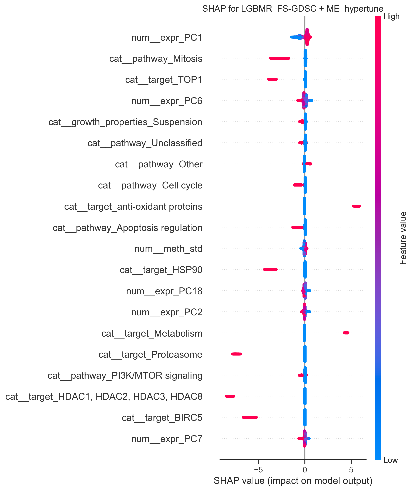<br>
Figure: SHAPley plot of the top features by importance (x axis Sensitivity -> Resistance of the drug IC50).

# Conclusion:

In the head to head comparison of models with the core GDSC dataset, the MLPRegressor had the highest performance, followed closely by the LGBMRegressor. The LGBMRegressor was selected for the remainder of the study due being 10-20 times faster to train and having slightly lower performance than that of the MLPregressor. This was due to limitations in compute, that resulted in long hyper parameter and feature searching with MLPREgressor. 

The addition of methylation and expression to the GDSC dataset resulted in 5.9% reduction in RMSE and an increase of 0.036 for R2, with the major driving of model improvements being that of expression (see results section).  Expression principle components 1, 6, 18, 2, and 7 were in the top 20 important features per SHAP analysis. 

Analyzing the model by grouping the data by drug target-bathway and cancer-type groups enables the ability to have high [need a word] predictions.  In the future, a model trained these groupings may yield even higher performance. In addition, the data showed that combining multiple models into a multitask model utilizing the best model per a drug pathway-cancer combination provide even higher performance across more drug pathway cancer groups and covered 21.8% of the total 622 pathway–cancer group wth an R2 > 0.9.

---

# Next steps

It is important to note that the total number of unique drug pathway-cancer combinations exceeded the highest number for any individual model.  Therefore, in the future a multitask model will be explored to get the highest number of combinations above an R2 of 0.9.

* Develop a multi-task model utilizing the best model per drug target-pathway by cancer combination.
* Evaluate the removal of methylation and the addtion of copy-number alteration features (Gene_level_CN.xlsx)  
* Ppredict potency of **new drugs** with SMILES embeddings  
* Validate on patient tumours (TCGA RNA-seq + WES)  
* Deploy as a Streamlit web-demo for interactive biomarker discovery

- Predict new drugs on already profiled cell lines 
In-silico compound triage: rank a library of novel inhibitors against a well-characterised cancer panel before wet-lab screening.


# Outline of Project
- [environment.yml](environment.yml) - setup enironment with condas + pip where needed
- [00_download.ipynb](notebooks/00_download.ipynb) — fetch & preprocess raw files  
- [01_eda.ipynb](notebooks/01_eda.ipynb) — data cleaning, feature engineering, EDA  
- [02_modeling.ipynb](notebooks/02_modeling.ipynb) — training, tuning, SHAP interpretation  

## Reproducibility
```bash
conda env create -f environment.yml
conda activate ucbaiml_gdsc
jupyter lab
# run notebooks in order 00 → 02
```

## Repository Structure
```
.
├── data/    # raw & processed inputs (git-ignored)
├── modles/  # saved models (git-ignored)
├── notebooks/
│ ├── 00_download.ipynb
│ ├── 01_eda.ipynb
│ └── 02_modeling.ipynb
├── pys/ # reusable Python modules
├── results/ # figures, SHAP plots, model artefacts
├── README.md
└── environment.yml
```
---
---


# References
- Yang et al., Nat Biotechnol 39, 2021 – “GDSC2” screen methodology.
- Tibshirani R., “Regression shrinkage and selection via the LASSO”, JRSS B.
- Lundberg S., Lee S.-I., “A Unified Approach to Interpreting Model Predictions”, NIPS 2017.

# Contact and Further Information
Feel free to open an issue or email for collaboration opportunities.


