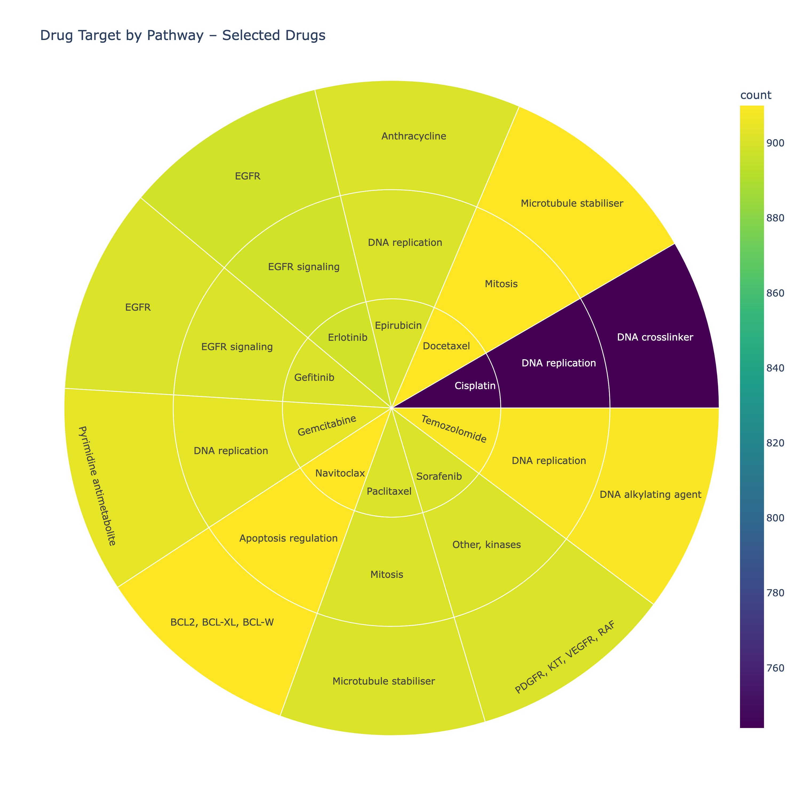

EDitted

# Predicting Drug Sensitivity of Cancer Cell Lines with Multi-Omics Integration
*UC Berkeley AI/ML Professional Certificate — Capstone, Spring 2025*  
Author  |  Brian Rabkin

**Context:**

🔄 = placeholder during module 20.1 (Draft report)


---

# Executive summary
Precision oncology hinges on matching the right drug to the right tumour profile.  
Using the **Genomics of Drug Sensitivity in Cancer II (GDSC 8.5)** screen plus
DNA-methylation, somatic-mutation and gene-expression layers, machine-learning models are trained to predict **log-IC50** values for 278 drugs
across >900 human cancer cell lines.  

The best gradient-boosted tree model (LightGBM) attains **RMSE = 🔄 μM** and
classifies “sensitive” lines with **AUROC = 🔄** on an **unseen-cell-line**
validation set, demonstrating that multi-omics features improve out-of-sample
accuracy over GDSC features alone.


# Rationale

* Cancer remains on of the leading causes of death globally, costly to treat, and personalized medicine is key to effective treatment.
* Development of therapies is a costly venture. Therefore, reducing development time and resources will help advance new drug candidates through the pipeline.
* Wet-lab dose–response assays cost \$10–\$40 per compound–cell-line pair.  
* A predictive **in-silico triage** system focuses experiments on the most promising drug–tumour pairs, accelerating biomarker discovery and reducing R&D cost.  
* Next-generation sequencing data are now routine; integrating these omics layers into predictive models enables **personalised therapy selection**.


## Objectives 
- Leverage publicly available Genomics of Drug Sensitivity in Cancer (GDSC-II) datasets for training and evaluation of the model.  
  
- Integrate methylation, mutation and expression  datasets, from other publically available sources, with the GDSC II dataset.

- Develop and evaluate machine learning models for predicting the drug log-IC50 for specific cancers, cell types and drugs. 

- Evaluate wether methylation, mutation and/or expression are key features for predicting drug IC50.  

- Evaluate wether utilising the drug-response AUC as the target outperforms ln_ic50 for suppervised learning.

---

# Research Question
**Can multi-omics features (gene expression, DNA methylation, somatic mutations) improve the prediction of log-IC50 for drugs tested in GDSC when applied to *new, previously unseen* cancer cell lines?**

# Data Sources
The following datasets were downloaded and combined using COSMIC_ID and Drug_id as keys, into a single dataframe ***(merged_df)*** as an input for data understanding and preperation. 

| Layer | File | Rows / Cols | Source |
|-------|------|-------------|--------|
| **Drug response (core)** | `GDSC2_fitted_dose_response_27Oct23.xlsx` | 295 drugs × 242 k assays | GDSC 8.5 |
| **Drug annotations** | `screened_compounds_rel_8.5.csv` | 621 | GDSC 8.5 |
| **Cell metadata** | `Cell_Lines_Details.xlsx` | 1001 | GDSC 8.5 |
| DNA-methylation | `GSE68379_Matrix.processed.txt.gz` | 486 k probes | GEO GSE68379 |
| WES mutations | `WES_variants.xlsx` | 486 k genes | GDSC 7.0 |
| Gene expression | `sanger1018_brainarray_ensemblgene_rma.txt.gz` | 18 k genes | GDSC 7.0 |

---

# Methodology

1. **Data engineering**  
   *Key steps*  
    * Parse omics files, harmonise **COSMIC_ID** and **DRUG_ID** keys  
    * Filter mutation table to 478 curated driver genes; create binary flags  
    * Derive methylation **median** & **std** per cell line (→ 2 features)  
    * PCA-reduce expression to top-100 PCs (80 % variance)  
    * Merge into a single `merged_df` (224 104 rows × 1 219 features)  
    * Split 80 / 20 by **COSMIC_ID** (GroupShuffle) ⇒ unseen cell lines in validation  
    * Create confidence weights `w = 1 / (rmse + ε)` (top 1 % clipped)

    EDA notebooks (`00_download.ipynb`, `01_eda.ipynb`) show missingness maps,
    lineage distributions and pair-plots of ln-IC50 vs omics summaries.

2. **Data Splitting - Drug-Wise Stratified Unseen Cell Line Split**

3. **Baseline Models** 
For baseline the baseline model an LGBMRegressor was trainined on the core (GDSC) data set only and without weights. For the purpose of comparing regressor with classification models, regression predictions are additionally thresholded at each drug’s 25% IC50 quantile to compute AUROC / PR-AUC, enabling direct comparison with binary classifiers. This enambled th ecalculation of Accuaryc, Precision, Recall, RMSE, MAE and FBeta. 

---
4. **Model families evaluated**

    In this sudy, a series of regression (2), classificaiton (2) and deep learning (1) models will be evaluate using the complete combined dataset of GDSC drug response, methylation, mutation and expression.  Models will be evaluated and the best model selected for determining if the addition of some or all of the non-GDSC data improved model performance.

    The initial list of models includes:

    | 	Model	 | 	Brief description / notes	 | 	Library	 | 
    | 	--------	 | 	-----------	 | 	----------	 | 
    | 	***Continuous-target (regression)***	 | 		 | 		 | 
    | 	LGBMRegressor (baseline & optimized)	 | 	Gradient-boosted decision trees, native categorical support, fast on 100 k + rows	 | 	lightgbm	 | 
    | 	XGBRegressor	 | 	Complementary GBDT implementation; often rivals/edges out LightGBM on tabular data	 | 	xgboost	 | 
    | 	MLPRegressor	 | 	Feed-forward neural net (dense) – serves as the neural-network baseline	 | 	scikit-learn / PyTorch-TabNet	 | 
    | 	***Binary-target (classification)***	 | 		 | 		 | 
    | 	DecisionTreeClassifier	 | 	Transparent baseline; matches your current pipeline	 | 	scikit-learn	 | 
    | 	RandomForestClassifier	 | 	Stronger ensemble; handles class imbalance with class-weights	 | 	scikit-learn	 | 

The baseline LGBMRegressor model achieved a 0.69 R^2 and Accuarcy of 0.72.

5. **Feature Addition Experiment**

    The following combination of data sets will be used to evaluate the contribution of methylation, mutation and expression to with the GDSC on model performance.

    | 	Condition	 | 	GDSC	 | 	Methylation (M)	 | 	Mutation (V)	 | 	Expression (E)	 | 
    | 	--------	 | 	-----------	 | 	--------	 | 	-----------	 | 	----------	 | 
    | 	Impact of GDSC only *	 | ✔ | 		 | 		 | 		 | 
    | 	Impact of GDSC with M	 | ✔ | ✔ | 		 | 		 | 
    | 	Impact of GDSC with M + V	 | ✔ | ✔ |  ✔ | 		 | 
    | 	Impact of GDSC with  M + E	 | ✔ | ✔ | 		 |  ✔ | 
    | 	Impact of GDSC with  M + V + E	 | ✔ |  ✔ |  ✔  |  ✔ | 
      * Used for Base Models and Selection of the Best Model				


    Feature selection uses `SelectFromModel` wrapped around LightGBM.
    Regression models are tuned with Optuna; classifiers use class-weights
    to counter residual imbalance after within-drug quartile binarisation.


6. **Final Model: Feature-selection & Hyper-tune (best feature combo)** 

7. **Interpretation** – SHAP TreeExplainer on top model

## Evaluation Metrics
| Task | Primary metric | Secondary |
|------|----------------|-----------|
| Regression | **RMSE**, MAE, R², Spearman ρ | Weighted RMSE (RMSE_w) |
| Classification | **AUROC**, PR-AUC | F1, Precision@Recall=0.8 |

  Regression predictions are additionally thresholded at each drug’s 25 %
  IC50 quantile to compute AUROC / PR-AUC, enabling direct comparison with
  binary classifiers.

# Results *(draft)*

## Data set
The merged data set has 921 cell lines with drug response data for 278 drugs.  Due to the high dimensionality, a subset of drugs is shown below for purposes of illustrating the data.

 | 	Condition	 | 	Number	 | 	Number	 | 
 | 	--------	 | 	-----------	 | 	-----------	 | 
 | 	Drugs	 | 		 | 	286	 | 
 | 		 | 	Target Pathways	 | 	24	 | 
 | 		 | 	Targets	 | 	185	 | 
 | 	Cell Lines	 | 		 | 	912	 | 
 | 		 | 	Tissue Types (desc 1)	 | 	19	 | 
 | 		 | 	Tissue Types (desc 1)	 | 	55	 | 
 | 		 | 	Cancer Types	 | 	32	 | 
 | 		 | 	Growth Properties	 | 	3	 | 
 | 	Methylation sites	 | 		 | 	485.5 K*	 | 
 |     | 		* Median and Std / cell line used  as features| 	| 
 | 	Mutation Sites	 | 	mutations (any non-synonymous variant present)	 | 	478	 | 
 | 		 | 	misssense	 | 	13	 | 
 | 		 | 	indels	 | 	133	 | 
 | 		 | 	truncation	 | 	0	 | 
 | 		 | 	other (not missense, indels, truncations)	 | 	478	 | 
 | 	Expression	 | 	Genes (used to generate PCA)	 | 	486 k	 | 
 | 		 | 	Principle Components	 | 	100	 | 


## Visulaizaiton of data

**Cell Information:**

<br>
Figure: Number of cell lines per cancer type

<br>
Figure: Growth properites of cell lines by cancer type.

<br>
Figure: Tissue types 1 and 2 of cell lines by cancer type


**Drug Information:**


<br>


<br>

<br>


A subset of drugs is plotted to reduce the clutter in the plot:
  ['Cisplatin', 'Docetaxel', 'Doxorubicin', 'Epirubicin',  'Erlotinib','Gefitinib', 
   'Gemcitabine', 'Navitoclax','Paclitaxel', 'Sorafenib', 'Temozolomide']


<br>
Figure of target and pathway for subset of drugs


## Model evaluation

The baseline LGBMRegressor results are as follows, all other models will be evaluated in the next phase of the project. 

|	Model	|	Features	|	Split	|	Model_Type	|	Time	|	Accuracy	|	Precision	|	Recall	|	FBeta	|	RMSE	|	MAE	|	R2	|
|	:---------------------	|	:--------	|	:--------	|	:-------------	|	-------:	|	-----------:	|	------------:	|	---------:	|	--------:	|	--------:	|	--------:	|	-------------:	|
|	LightGBM (GDSC-only baseline)	|	17	|	Train	|	regression	|	0.97	|	0.74	|	0.46	|	0.35	|	0.40	|	1.52	|	1.16	|	0.69	|
|	LightGBM (GDSC-only baseline)	|	17	|	Test	|	regression	|	0.08	|	0.72	|	0.45	|	0.33	|	0.38	|	1.57	|	1.19	|	0.67	|
|	DecisionTreeClassifier (GDSC-only baseline)	|	17	|	🔄	|	🔄	|	🔄	|	🔄	|	🔄	|	🔄	|	🔄	|	🔄	|	🔄	|	🔄	|
|	DecisionTreeClassifier + methylation + mutations	|	17	|	🔄	|	🔄	|	🔄	|	🔄	|	🔄	|	🔄	|	🔄	|	🔄	|	🔄	|	🔄	|
|	LightGBM + methylation + mutations	|	17	|	🔄	|	🔄	|	🔄	|	🔄	|	🔄	|	🔄	|	🔄	|	🔄	|	🔄	|	🔄	|
|	XGBoost + same features	|	17	|	🔄	|	🔄	|	🔄	|	🔄	|	🔄	|	🔄	|	🔄	|	🔄	|	🔄	|	🔄	|
|	MLP (100-64-32)	|	17	|	🔄	|	🔄	|	🔄	|	🔄	|	🔄	|	🔄	|	🔄	|	🔄	|	🔄	|	🔄	|
|	Final Model Type	|	1 219	|	🔄	|	🔄	|	🔄	|	🔄	|	🔄	|	🔄	|	🔄	|	🔄	|	🔄	|	🔄	|

\* regression outputs thresholded at within-drug 25 % IC50 quantile.

*SHAP summary* identifies **methylation std**, haematopoietic lineage, and drug pathway (PI3K/mTOR) as top predictors.
To be added during final data selection

## Baseline LGBMRegressor Results:

<br>
Figure: Scatter plot of prediction and target

<br>
Figure: Mean R2 value by drug or cell line attribute.


---

# Next steps
* Add copy-number alteration features (Gene_level_CN.xlsx)  
* Ppredict potency of **new drugs** with SMILES embeddings  
* Validate on patient tumours (TCGA RNA-seq + WES)  
* Deploy as a Streamlit web-demo for interactive biomarker discovery

- Predict new drugs on already profiled cell lines 
In-silico compound triage: rank a library of novel inhibitors against a well-characterised cancer panel before wet-lab screening.


# Outline of Project
- [00_download.ipynb](notebooks/00_download.ipynb) — fetch & preprocess raw files  
- [01_eda.ipynb](notebooks/01_eda.ipynb) — data cleaning, feature engineering, EDA  
- [02_modeling.ipynb](notebooks/02_modeling.ipynb) — training, tuning, SHAP interpretation  

## Reproducibility
```bash
conda env create -f environment.yml
conda activate ucbaiml_gdsc
jupyter lab
# run notebooks in order 00 → 02
```

## Repository Structure
```
.
├── data/    # raw & processed inputs (git-ignored)
├── modles/  # saved models (git-ignored)
├── notebooks/
│ ├── 00_download.ipynb
│ ├── 01_eda.ipynb
│ └── 02_modeling.ipynb
├── pys/ # reusable Python modules
├── results/ # figures, SHAP plots, model artefacts
├── README.md
└── environment.yml
```
---
---


# References
- Yang et al., Nat Biotechnol 39, 2021 – “GDSC2” screen methodology.
- Tibshirani R., “Regression shrinkage and selection via the LASSO”, JRSS B.
- Lundberg S., Lee S.-I., “A Unified Approach to Interpreting Model Predictions”, NIPS 2017.

# Contact and Further Information
Feel free to open an issue or email for collaboration opportunities.


